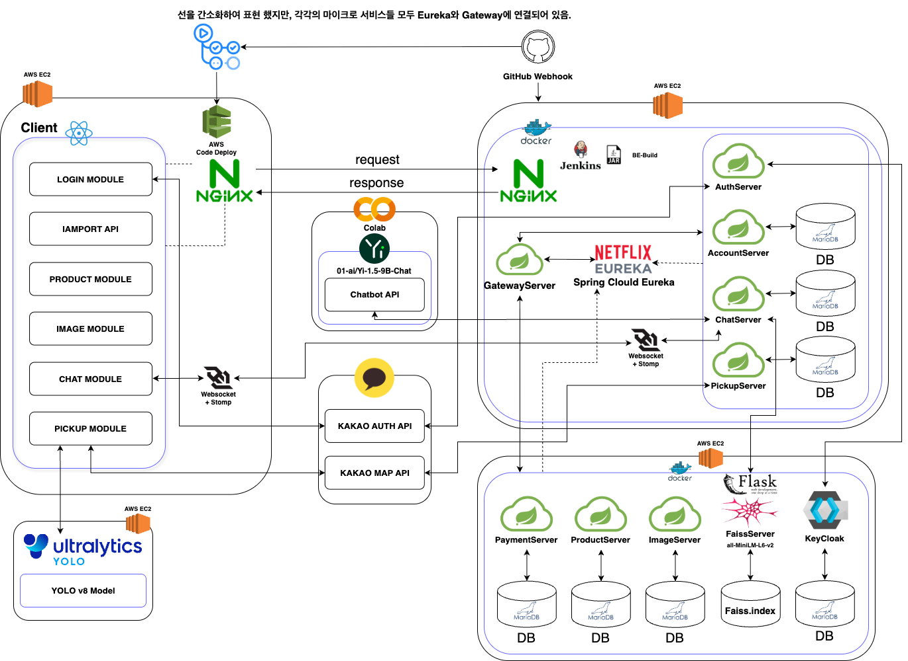
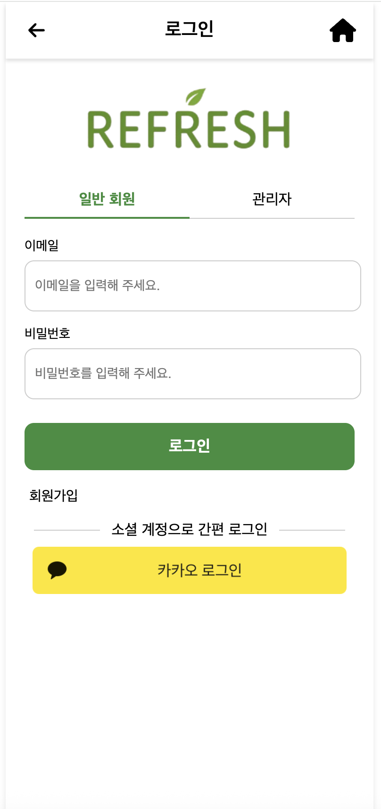
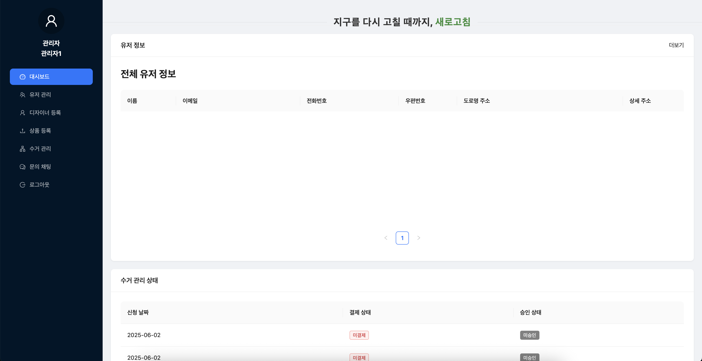

  

<h1 align="center">RELOAD_F5</h1>
<h3 align="center">지구를 다시 새로고칠 때까지, 새로고침</h3>

## 🌍 프로젝트 소개

### 💡 **프로젝트 의미**

**새로고침(F5)은 환경 보호와 경제적 순환을 동시에 실현하는 혁신적인 통합 플랫폼입니다.**  
*폐기물 수거부터 업사이클링 상품 판매까지 자원 순환의 전 과정을 스마트하게 연결하여 완전한 순환 경제 생태계를 구축합니다.*

### 🔄 **핵심 순환 구조**

**폐기물 수거** ➡️ **AI 기반 분류** ➡️ **업사이클링 제작** ➡️ **상품 판매** ➡️ **경제적 순환** ↩️

1. **폐기물 수거** → AI 기반 YOLO 객체 인식으로 효율적 분류
2. **재활용 가공** → 검증된 에코 디자이너를 통한 업사이클링 제품 제작
3. **상품 판매** → 온라인 마켓플레이스를 통한 친환경 생활용품 유통

### 🎯 **핵심 서비스**

| 🚛 스마트 수거 시스템 | 🤖 AI 고객 지원 | 🛍️ 업사이클링 마켓 | 🔧 통합 관리 시스템 |
|:---:|:---:|:---:|:---:|
| 방문 수거 서비스와 수거기사 전용 앱으로 최적 경로 안내 | GPT-4 기반 RAG 챗봇과 실시간 채팅으로 24/7 고객 상담 | 재활용품으로 제작된 창의적인 생활용품 판매 플랫폼 | 디자이너 등록부터 상품 관리, 수거 관리까지 원스톱 운영 |

*새로고침은 단순한 재활용을 넘어 **환경 보호가 경제적 수익으로 이어지는 지속 가능한 비즈니스 모델**을 제시하며,  
사용자들이 일상에서 자연스럽게 환경 보호에 참여할 수 있도록 돕습니다.*

## 👥 개발팀 소개

### 🤝 **팀 구성**

| **개발자** | **[한동균](https://github.com/hdg5639)** | **[박상우](https://github.com/Babsang0826)** | **[손경락](https://github.com/ganglike248)** | **[서동섭](https://github.com/dongsubnambuk)** |
| :-: | :-: | :-: | :-: | :-: |
| **프로필** |  |  |  |  |
| **기술 스택** |  |  |  |  |
| **역할** | `백엔드` | `백엔드` | `프론트엔드` | `프론트엔드` |

## 🏗️ 시스템 구성

### 📊 **시스템 아키텍처**

저희 시스템은 **마이크로서비스 아키텍처**를 기반으로 설계되어, 각 서비스가 독립적으로 운영되면서도 유기적으로 연결됩니다.

## ⭐ 주요 기능 소개

새로고침 플랫폼은 **사용자**와 **관리자**를 위한 차별화된 기능을 제공합니다.  
각각의 역할에 최적화된 인터페이스와 기능으로 최상의 사용자 경험을 제공합니다.

### 👤 **사용자를 위한 편리한 서비스**

일반 사용자들이 쉽고 편리하게 환경 보호 활동에 참여할 수 있도록 다양한 기능을 제공합니다.

| 🔧 **기능** | 📝 **설명** | 📸 **이미지** |
|:---:|:---|:---:|
| **🏠 메인페이지** | 업사이클링 상품구매, 서비스 소개 |  |
| **💰 상품 구매** | 결제 전 확인 |  |
| **📋 상품 상세** | 상품 상세 정보, 구매 옵션 선택, 장바구니 담기 |  |
| **🛒 장바구니** | 선택 상품 관리, 수량 조절, 총 금액 계산, 결제 진행 |  |
| **💳 결제시스템** | 다양한 결제 수단, 최신 보안 프로토콜, 효율적인 결제 흐름 |  |
| **📊 주문 내역** | 과거 주문 조회, 상세 내역 확인 |  |

### 🗑️ **스마트 수거 신청 시스템**

사용자가 쉽게 폐기물 수거를 신청할 수 있도록 **4단계 간편 프로세스**를 제공합니다.

| **단계** | **설명** | **화면** |
|:---:|:---|:---:|
| **🗑️ 수거신청** | 폐기물 방문 수거 신청, 예상 비용 제공, 일정 예약 시스템 (4단계 프로세스) | 

<strong>📝 1단계: 예약 시스템</strong>
 
<strong>👤 2단계: 유저 정보</strong>
 
<strong>♻️ 3단계: 폐기물 선택</strong>
 
<strong>✅ 신청 완료</strong>

 |

### 📋 **수거 내역 관리**

신청한 수거 서비스의 진행 상황을 실시간으로 확인할 수 있습니다.

| **기능** | **설명** | **화면** |
|:---:|:---|:---:|
| **📋 수거 내역** | 과거 수거 신청 내역, 진행 상황 추적, 수거 완료 확인 | 

<strong>📄 수거 신청 목록</strong>
 
<strong>🔍 수거 신청 상세</strong>

 |

### 🤖 **AI 기반 고객 지원**

AI 기술을 활용한 **24시간 고객 상담 서비스**를 제공합니다.

| **기능** | **설명** | **화면** |
|:---:|:---|:---:|
| **🤖 AI 챗봇** | 자동 응답, GPT-4 기반 지능형 상담, 상담사 자동 연결 | 

<strong>💬 챗봇 대화</strong>
 
<strong>🏷️ 카테고리 선택</strong>

 |
| **💬 실시간채팅** | 고객 상담, 문의 카테고리 선택, 실시간 응답, 상담 내역 저장 |  |

### 👤 **개인 서비스 관리**

개인정보와 서비스 이용 내역을 한 곳에서 편리하게 관리할 수 있습니다.

| **기능** | **설명** | **화면** |
|:---:|:---|:---:|
| **👤 마이페이지** | 개인정보 관리, 주문/수거 내역 |  |
| **🔐 간편 로그인** | 소셜 로그인 지원, OAuth 2.0 보안, 다양한 로그인 옵션 |  |

---

### 👨‍💼 **관리자를 위한 효율적인 운영 도구**

시스템 운영자와 관리자가 효율적으로 서비스를 관리할 수 있는 **전문 관리 도구**를 제공합니다.

| 🔧 **기능** | 📝 **설명** | 📸 **이미지** |
|:---:|:---|:---:|
| **🏠 관리자메인** | 전체 시스템 현황 모니터링, 실시간 통계 대시보드, 중요 알림 및 빠른 액세스 |  |
| **👨‍🎨 디자이너관리** | 에코 디자이너 등록 및 승인, 프로필 관리, 작품 포트폴리오 검토 |  |
| **📦 상품 등록** | 업사이클링 상품 등록, 상품 정보 관리, 카테고리 분류, 가격 설정 |  |
| **🚛 수거 관리** | 수거 요청 관리, 수거기사 배정, 일정 조정, 수거량 분석 |  |
| **💬 고객 채팅** | 실시간 고객 문의 응답, 다중 채팅 관리, 문의 분류, 상담 히스토리 |  |

---

### 🌍 **지구를 다시 새로고칠 때까지, 새로고침과 함께하세요!** 🌱

